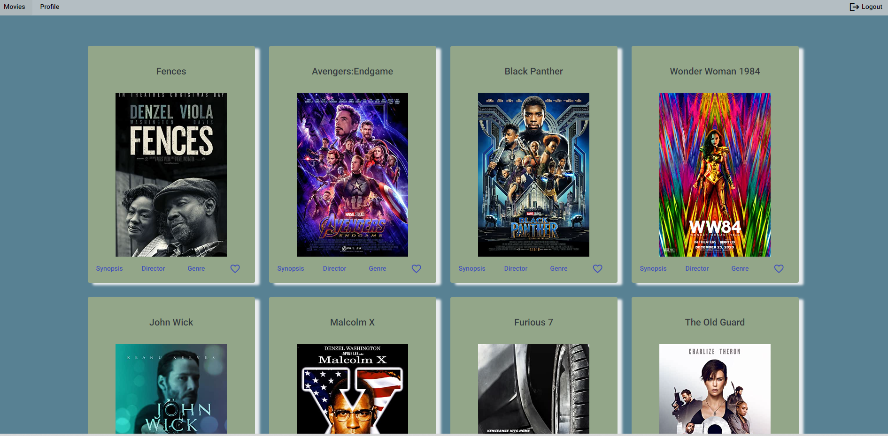

# MyFlixAngular

## General notes on this Angular project

This project was generated with [Angular CLI](https://github.com/angular/angular-cli) version 14.1.0.

### Development server

Run `ng serve` for a dev server. Navigate to `http://localhost:4200/`. The application will automatically reload if you change any of the source files.

### Code scaffolding

Run `ng generate component component-name` to generate a new component. You can also use `ng generate directive|pipe|service|class|guard|interface|enum|module`.

### Build

Run `ng build` to build the project. The build artifacts will be stored in the `dist/` directory.

### Running unit tests

Run `ng test` to execute the unit tests via [Karma](https://karma-runner.github.io).

### Running end-to-end tests

Run `ng e2e` to execute the end-to-end tests via a platform of your choice. To use this command, you need to first add a package that implements end-to-end testing capabilities.

### Further help

To get more help on the Angular CLI use `ng help` or go check out the [Angular CLI Overview and Command Reference](https://angular.io/cli) page.

### Deploy to gh-pages

Run `ng deploy --base-href=/myFlix-angular/`

## Description

This project aims to build the client-side for an application called myFlix using Angular based on its existing server-side code (REST API and database), with supporting documentation.

## User Stories

- As a user, I want to be able to receive information on movies, directors, and genres so that I can learn more about movies I’ve watched or am interested in.
- As a user, I want to be able to create a profile so I can save data about my favorite movies.

## Key Features

- Welcome view where users can either log in or register an account
- Upon authentication, display a view of all Movies
- Each movie card will contain the following additional features:
  - A button that when clicked will display a brief description of the movie.
  - A button that when clicked takes a user to the ​director view,​ where details about the director of that particular movie will be displayed.
  - A button that when clicked takes a user to the ​genre view,​ where details about that particular genre of the movie will be displayed.
  - A button that when clicked will add a movie to a user's list of favorites.
- The user can view his favorite movies on his profile page and edit/delete his user info

## Technology

- Angular

## Challenges & Lessons

## Development Process

### Install Angular

1. Check if Angular is already installed on the device

`ng --version`

2. If not, install Angular

`npm install -g @angular/cli`

## Create a new Angular project

1. Open your terminal and create a project

`ng new my-project-name`

2. Navigate to the project folder to run project

`ng serve --open`

## Set up the app to load data from movie API

Set up Angular HttpClient 

1.1. Go to app.module.ts and add

import { HttpClientModule } from '@angular/common/http'

1.2. Add HttpClientModule to the imports of @NgModule

Create Angular Service for Consuming REST API 2.1 Create a new Service inside app folder

ng generate service fetch-api-data-service

2.2. Add import statements to fetch-api-data.service.ts file

import { catchError } from 'rxjs/operators';
import { HttpClient, HttpHeaders, HttpErrorResponse } from '@angular/common/http';
import { Observable, throwError } from 'rxjs';
import { map } from 'rxjs/operators';

3. Implement services logic to make API calls

- User registration
- User login
- Get all movies
- Get one movie
- Get director
- Get genre
- Get user
- Add a movie to favorite Movies
- Delete a movie from favorite movies
- Edit user
- Delete user

## Add Angular Material

1. Install project dependency

$ ng add @angular/material

2. Import models from Angular Material to app.module.ts

3. Add modules to imports array to serve to other components

## Create  user components

Use the command

$ ng generate component my-component-name

Structure of components:

- Welcome view
- User registration view (signup)
- User login view
- Navbar view
- Movie Card View
  Dialogs for Movie Card:
  - Director view
  - Genre view
  - Description view
- Profile View
- Edit profile dialog

## Add app routing

1. Import Angular's built-in router:

import { RouterModule, Routes } from '@angular/router';

2. Add to app.component.html

<router-outlet></router-outlet> 

3. Create routes in app.module.ts

## Deploy app on gh-pages

1. If not done yet: Create a GitHub repository for the application

2. If also not done yet: Link the new remote repository to the local project folder. To do so, simply run this command from inside your project folder (replace and with your own GitHub username and repository name): git remote add origin [https://github.com//.git]

3. Add angular-cli-ghpages by running

ng add angular-cli-ghpages.

4. Build your application (i.e., generate static HTML, CSS, and JavaScript files out of your application so that browsers can interpret them without the need to use any extra tools/plugins). To do so, run the following command, replacing it with your repository name:

ng deploy --base-href=/repository-name/

## Add TypeDoc Documentation

1. Install typedoc (if not yet installed)

npm install typedoc

2. Check that code is commented adhering to best practices

3. Run typedoc to create documentation

npx typedoc --entryPointStrategy expand ./src

[Visit the site](https://junior-22.github.io/myFlix-angular/)